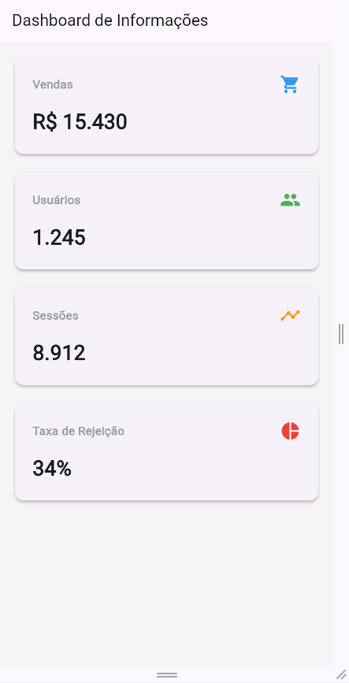
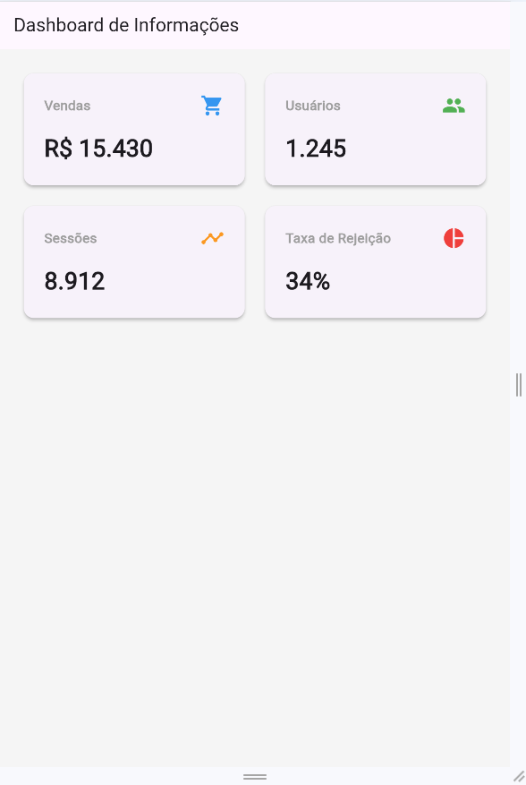
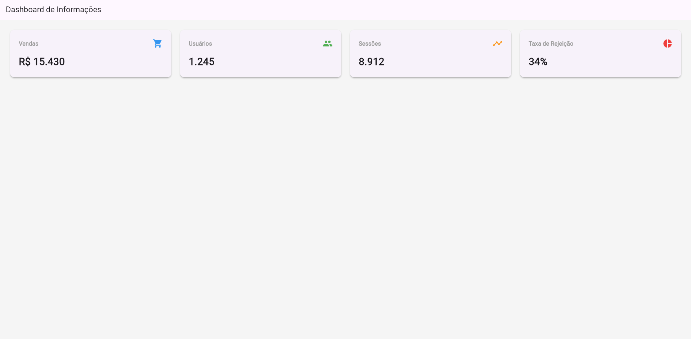

# Dashboard Responsivo em Flutter

Este é um projeto de um Dashboard responsivo desenvolvido em Flutter, que adapta seu layout automaticamente para três tamanhos de tela diferentes (Mobile, Tablet e Desktop) utilizando `MediaQuery` e widgets flexíveis.

**Nome:** Gabriel Godoy Motta  
**Turma:** Análise e Desenvolvimento de Sistemas (ADS) - 5º Fase

---

## Layouts (Screenshots)

### 1. Mobile (< 600px)
*Layout em coluna única (1 card por linha).*


### 2. Tablet (600px - 900px)
*Layout em grade (2 cards por linha).*


### 3. Desktop (> 900px)
*Layout em linha única (4 cards lado a lado).*


---

## Como executar o projeto

Siga os passos abaixo para rodar o aplicativo na sua máquina:

### Pré-requisitos
* [Flutter SDK](https://docs.flutter.dev/get-started/install) instalado e configurado.
* Um editor de código (como VS Code) com a extensão do Flutter instalada.
* Um navegador web (Chrome/Edge) ou um emulador configurado.

### Passos para execução

1. **Clone o repositório** (caso esteja usando Git) ou baixe a pasta do projeto:
   ```bash
   git clone https://github.com/godoy220/DashBoard_Responsivo.git